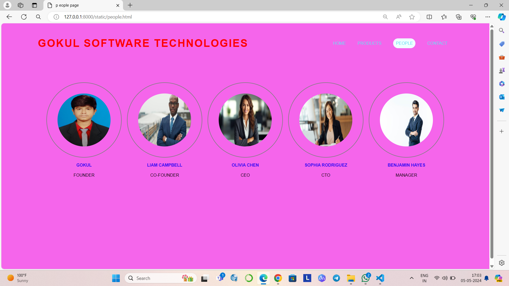
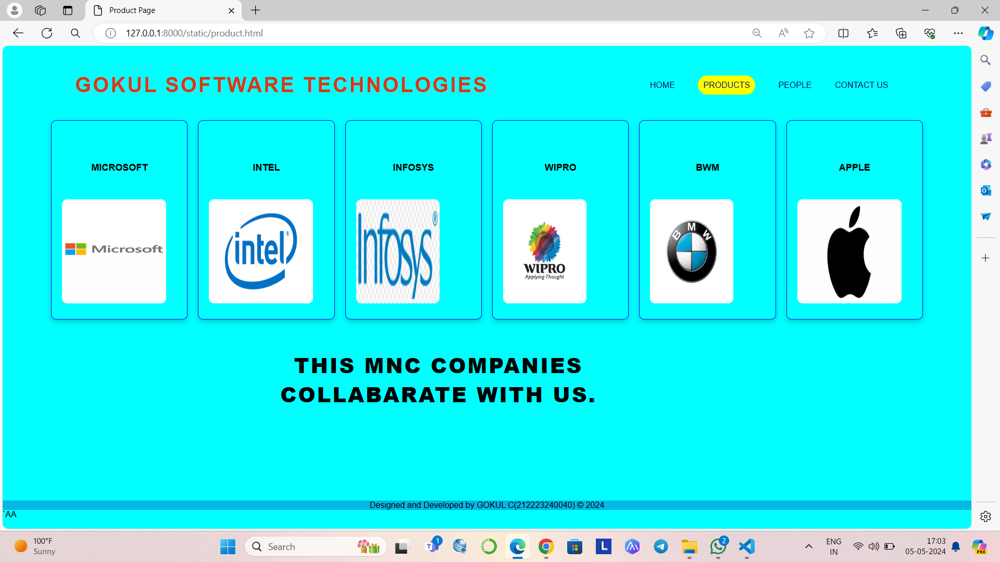
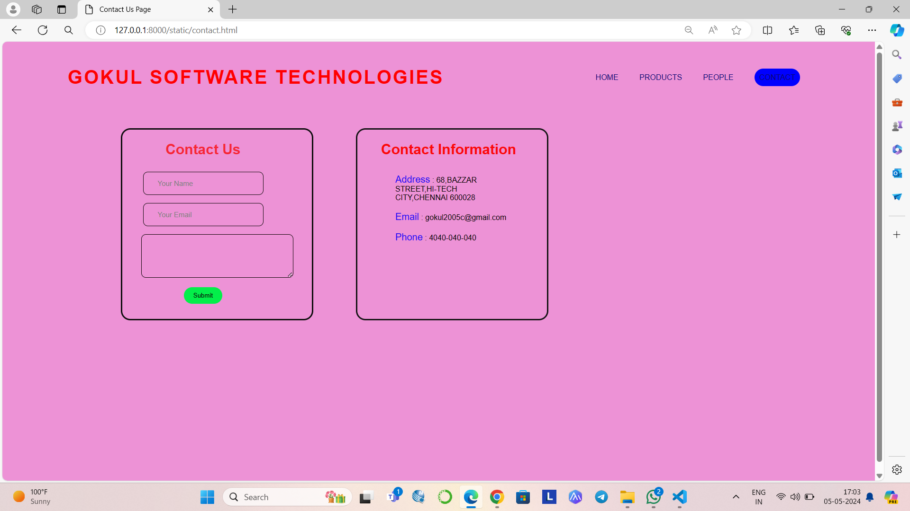

# Ex.07 Software Product Company Website
## Date:23/04/2024

## AIM:
To develop a static company website to display the softwares and services provided by the company.

## DESIGN STEPS:

### Step 1:
Requirement collection.

### Step 2:
Creating the layout using HTML and CSS.

### Step 3:
Updating the sample content.

### Step 4:
Choose the appropriate style and color scheme.

### Step 5:
Validate the layout in various browsers.

### Step 6:
Validate the HTML code.

### Step 7:
Publish the website in the given URL.

## PROGRAM:

```
home.html


<html>
    <head>
        <meta name="viewport" content="width=device-width, initial-scale=1.0">
        <title> Software Development Company </title>
        <style type="text/css">
            * {
                margin: 0;
                padding: 0;
                font-family: Arial, Helvetica, sans-serif, Helvetica, sans-serif;
            }
            .banner {
                width: 100%;
                height: 100vh;
                background :rgb(94, 246, 183);
                background-size: cover;
                background-position: center;
            }
            .navbar {
                width: 85%;
                margin: auto;
                padding: 35px 0;
                display: flex;
                align-items: center;
                justify-content: space-between;
            }
            .bg-HOME {
                border: 1px;
                padding: 10px;
                color: gray;
                background-color:#07f039;
                border-radius: 30px;
            }
            .logo {
                color:rgba(255, 0, 0, 0.564);
                font-size: 40px;
                font-weight: 700;
                letter-spacing: 3px;
            
            }
            span {
                color: rgb(187, 184, 184);
            }
            form {
                width: 300px;
                height: 40px;
                display: flex;
                background: green;
                padding: 1px 1px;
                font-size: 15px;
                border-radius: 10px;
                backdrop-filter: blur(4px) saturate(180%);
            }
            form input {
                background: transparent;
                flex: 1;
                border: 0;
                outline: none;
                padding: 12px 20px;
                font-size: 20px;
                color: rgb(102, 103, 102);
            } 
            ::placeholder {
                color: rgb(67, 65, 65);
            }
            form button {
                border: 0;
                outline: none;
                padding: 5px 20px;
                color: rgb(66, 66, 66);
                border-radius: 10px;
                background:#6e4ad2;
                cursor: pointer;
            }
            .navbar li {
                list-style: none;
                display: inline-block;
                margin: 0 20px;
                position: relative;
            }
            .navbar li a {
                text-decoration: none;
                color: rgb(11, 6, 117);
                text-transform: uppercase;
            }
            .navbar li:hover {
                border: 1px;
                padding: 10px;
                color: rgb(26, 12, 221);
                background-color:#07f039;
                transition: 0.5s; 
                cursor: pointer;
                border-radius: 30px;
            }
            .content {
                position: absolute;
                top: 50%;
                left: 50%;
                transform: translate(-50%,-50%);
                text-align: center;
            }
            .text h2 {
                color: rgb(17, 141, 218);
                font-weight: 800;
                font-size: 50px;
                letter-spacing: 3px;
            }
            .text p {
                color: rgb(13, 1, 1);
                text-transform: capitalize;
                font-size: 15px;
                margin-bottom: 30px;
                word-spacing: 2px;
                letter-spacing: 1px;
            }
            .image {
                margin: 100px 10opx;
                border: 100PX solid#06eaf6;
                color: rgb(9, 9, 9);
                border-radius: 200px;
        
            

            }
           
            footer {
                background-color:aliceblue;
                margin-top: auto;
            }
        </style>
    </head>
<body>
    <div class="banner">
        <br>
        <div class="navbar">
            <h1 class="logo">GOKUL SOFTWARE TECHNOLOGIES</h1>
            <ul>
                <li><a href="http://127.0.0.1:8000/static/softapp.html"> Home </a></li>
                <li><a href="http://127.0.0.1:8000/static/p.html"> Products </a></li>
                <li><a href="http://127.0.0.1:8000/static/people.html"> People </a></li>
                <li><a href="http://127.0.0.1:8000/static/contact.html"> Contact </a></li>
            </ul>
            
        </div>
        <div class="content">
            <div class="text">
                <h2> Software Development Company </h2>
                <br>
                <p>Empowering businesses with innovative software solutions tailored to their unique needs, driving efficiency and growth in a rapidly evolving digital landscape.</p>
                <br>
                <div>
                    
                </div>
                
            </div>
        </div>  
    </div>
    <footer>
        <center>Designed and Developed by GOKUL C(212223240040) &copy; 2024</center>
    </footer>
</body>
</html>


people.html


<html>
    <head>
        <meta name="viewport" content="width=device-width, initial-scale=1.0">
        <title> p
eople page </title>
        <style type="text/css">
            * {
                margin: 0;
                padding: 0;
                font-family: Arial, Helvetica, sans-serif;
            }
            .banner {
                width: 100%;
                height: 100vh;
                background:rgb(245, 101, 235);
                background-size: cover;
                background-position: center;
            }
            .navbar {
                width: 85%;
                margin: auto;
                padding: 35px 0;
                display: flex;
                align-items: center;
                justify-content: space-between;
            }
            .bg-people {
                border: 1px;
                padding: 10px;
                color: gray;
                background-color:azure;
                border-radius: 30px;
            }
            .logo {
                color:RED;
                font-size: 40px;
                font-weight: 700;
                letter-spacing: 3px;
            }
            span {
                color: gray;
            }
            
            ::placeholder {
                color: gray;
            }
            form button {
                border: 0;
                outline: none;
                padding: 5px 20px;
                color: gray;
                border-radius: 10px;
                background:#6e4ad2;
                cursor: pointer;
            }
            .navbar li {
                list-style: none;
                display: inline-block;
                margin: 0 20px;
                position: relative;
            }
            .navbar li a {
                text-decoration: none;
                color: rgb(93, 221, 244);
                text-transform: uppercase;
            }
            .navbar li:hover {
                border: 1px;
                padding: 10px;
                color: rgb(80, 226, 245);
                background-color:#07f039;
                transition: 0.5s; 
                cursor: pointer;
                border-radius: 30px;
            }
            .image {
                position: relative;
                border: 0;
                top: 70px;
                background: transparent;
            }
            .image table {
                border: 0;
                color: rgb(56, 10, 244);
                position: relative;
                left: 150px;
            }
            .image table img {
                height: 200px;
                width: 200px;
                border: 2px solid gray;
                padding: 40px;
                border-radius: 50%;
            }
            .image table td {
                color:#0a0208;
            }
            footer {
                background-color:rgb(249, 245, 41);
                margin-top: auto;
            }
        </style>
    </head>
<body>
    <div class="banner">
        <br>
        <div class="navbar">
            <h1 class="logo">GOKUL SOFTWARE TECHNOLOGIES</h1>
            <ul>
                <li><a href="http://127.0.0.1:8000/static/softapp.html"> Home </a></li>
                <li><a href="http://127.0.0.1:8000/static/p.html"> Products </a></li>
                <li><a href="http://127.0.0.1:8000/static/people.html" class="bg-people"> People </a></li>
                <li><a href="http://127.0.0.1:8000/static/contact.html"> Contact </a></li>
            </ul>

        </div>
        <div class="image">
            <table cellspacing="20"> 
                <tr align="center">
                    <td>  </td>
                    <td>  </td>
                    <td>  </td>
                    <td>  </td>
                    <td>  </td>
                </tr>
                <tr align="center">
                    
                    <th>GOKUL</th>
                    <th>LIAM CAMPBELL</th>
                    <th>OLIVIA CHEN</th>
                    <th>SOPHIA RODRIGUEZ</th>
                    <th>BENJAMIN HAYES</th>
                </tr>
                <tr align="center">
                    <td>FOUNDER </td>
                    <td>CO-FOUNDER</td>
                    <td>CEO</td>
                    <td>CTO</td>
                    <td>MANAGER</td>
                </tr>
            </table>
        </div>
    </div>
    <footer>
        <center>Designed and Developed by GOKUL C(212223240040) &copy; 2024</center>
    </footer>
</body>
</html>


product.html


<html>
    <head>
        <meta name="viewport" content="width=device-width, initial-scale=1.0">
        <title> Product Page </title>
        <style type="text/css">
            * {
                margin: 0;
                padding: 0;
                font-family:  Arial, Helvetica, sans-serif, Helvetica, sans-serif;
            }
            .banner {
                width: 100%;
                height: 100vh;
                background:AQUA;
                background-size: cover;
                background-position: center;
            }
            .navbar {
                width: 85%;
                margin: auto;
                padding: 35px 0;
                display: flex;
                align-items: center;
                justify-content: space-between;
            }
            .bg-product {
                border: 1px;
                padding: 10px;
                color: gray;
                background-color:yellow;
                border-radius: 30px;
            }
            .logo {
                color:#e1320bf6;
                font-size: 40px;
                font-weight: 700;
                letter-spacing: 3px;
            }
            span {
                color: gray;
            }
            
            ::placeholder {
                color: gray;
            }
            form button {
                border: 0;
                outline: none;
                padding: 5px 20px;
                color: gray;
                border-radius: 10px;
                background:#6e4ad2;
                cursor: pointer;
            }
            .navbar li {
                list-style: none;
                display: inline-block;
                margin: 0 20px;
                position: relative;
            }
            .navbar li a {
                text-decoration: none;
                color: rgb(11, 6, 117);
                text-transform: uppercase;
            }
            .navbar li:hover {
                border: 1px;
                padding: 10px;
                color: rgb(11, 6, 117);
                background-color:yellow;
                transition: 0.5s; 
                cursor: pointer;
                border-radius: 30px;
            }
            .container {
                background: transparent;
                padding: 10px 5%;
                padding-bottom: 50px;
            }
            .container .box-container {
                display: grid;
                grid-template-columns: repeat(auto-fit, minmax(170px, 1fr));
                gap: 20px;
            }
            .container .box-container .box {
                color: rgb(11, 1, 1);
                box-shadow: 0 5px 10px rgba(0,0,0,.2);
                border-radius: 10px;
                background: transparent;
                border: 1px solid rgb(30, 7, 243);
                padding: 30px 20px;
            }
            .container .box-container .box img {
                height: 200px;
                border-radius: 10px;
            }
            .container .box-container .box h3 {
                color:#030303;
                font-size: large;
                padding: 50px 10;
            }
            .container .box-container .box p {
                color: gray;
                font-size: small;
                line-height: 1.5;
            }
            .content {
                position: absolute;
                top: 70%;
                left: 50%;
                margin-bottom:auto ;
                transform: translate(-60%,-50%);
                text-align: center;
            }
            .text h2 {
                color: black;
                font-weight: 800;
                font-size: 40px;
                letter-spacing: 3px;
            }
            footer {
                background-color:#06b7e3;
                margin-top: 16%;
            }
        </style>
    </head>
<body>
    <div class="banner">
        <br>
        <div class="navbar">
            <h1 class="logo">GOKUL SOFTWARE TECHNOLOGIES</h1>
            <ul>
                <li><a href="http://127.0.0.1:8000/static/softapp.html"> Home </a></li>
                <li><a href="http://127.0.0.1:8000/static/p.html" class="bg-product"> Products </a></li>
                <li><a href="http://127.0.0.1:8000/static/people.html"> People </a></li>
                <li><a href="http://127.0.0.1:8000/static/contact.html"> Contact us</a></li>
            </ul>
            
        </div>
        <div class="container">
            <div class="box-container">
                    
                
                <div class="box">
                    <h3 align="center"> MICROSOFT</h3>
                    <image src="microsoft.png" width="200" height="500"></image>
                </div>
                <div class="box">
                    <h3 align="center">INTEL</h3>
                    <image src="intel.png" width="200" height="500"></image>
                </div>
                <div class="box">
                    <h3 align="center">INFOSYS</h3>
                    <image src="infosys.png" width="160" height="500"></image>
                </div>
                <div class="box">
                    <h3 align="center">WIPRO</h3>
                    <image src="wipro.jpg" width="160" height="500"></image>
                </div>
                <div class="box">
                    <h3 align="center">BWM</h3>
                    <image src="BMW.jpg" width="160" height="500"></image>
                </div>
                <div class="box">
                    <h3 align="center">APPLE</h3>
                    <image src="apple.jpg" width="200" height="500"></image>
                </div>
                
            </div>
        <div class="content">
            <div class="text">
                <h2> THIS MNC COMPANIES COLLABARATE WITH US.</h2>
                <br>
              
            </div>
        </div>
        
    </div>
    <footer>
        <center>Designed and Developed by GOKUL C(212223240040) &copy; 2024</center>
    </footer>
</body>
</html>


contact.html


<html>
    <head>
        <meta name="viewport" content="width=device-width, initial-scale=1.0">
        <title> Contact Us Page </title>
        <style type="text/css">
            * {
                margin: 0;
                padding: 0;
                font-family: Arial, Helvetica, sans-serif;
            }
            .banner {
                width: 100%;
                height: 100vh;
                background:rgb(237, 146, 214);
                background-size: cover;
                background-position: center;
            }
            .navbar {
                width: 85%;
                margin: auto;
                padding: 35px 0;
                display: flex;
                align-items: center;
                justify-content: space-between;
            }
            .bg-contact {
                border: 1px;
                padding: 10px;
                color: gray;
                background-color:blue;
                border-radius: 30px;
            }
            .logo {
                color:RED;
                font-size: 40px;
                font-weight: 700;
                letter-spacing: 3px;
            }
            span {
                color: gray;
            }
            
            ::placeholder {
                color: gray;
            }
            .navbar form button {
                border: 0;
                outline: none;
                padding: 5px 20px;
                color: gray;
                border-radius: 10px;
                background:#6e4ad2;
                cursor: pointer;
            }
            .navbar li {
                list-style: none;
                display: inline-block;
                margin: 0 20px;
                position: relative;
            }
            .navbar li a {
                text-decoration: none;
                color: rgb(11, 6, 117);
                text-transform: uppercase;
            }
            .navbar li:hover {
                border: 1px;
                padding: 10px;
                color: rgb(11, 6, 117);
                background-color:#2307f4;
                transition: 0.5s; 
                cursor: pointer;
                border-radius: 30px;
            }
            .box {
                display: flex;
                column-gap: 40px;
                background: transparent;
                position: relative;
                top: 50px;
            }
            .box-1 {
                height: 400px;
                width: 400px;
                border: 3px solid rgb(12, 12, 12);
                border-radius: 20px;
                background: transparent;
                position: relative;
                left: 250px;
            }
            .box-2 {
                height: 400px;
                width: 400px;
                border: 3px solid#141314;
                border-radius: 20px;
                background: transparent;
                position: relative;
                left: 300px;
            }
            .box-1 form {
                display: flex;
                color: rgba(249, 9, 9, 0.785);
                background: transparent;
                padding: 10px;
                font-size: 15px;
                position: relative;
                top: 15px;
            }
            .box-1 form input {
                background: transparent;
                display: flex;
                border: 1px solid rgb(16, 10, 10);
                border-radius: 10px;
                padding: 15px 30px;
                font-size: 15px;
                color: rgb(6, 4, 4);
                position: relative;
                top: 30px;
            }
            .box-1 form textarea {
                background: transparent;
                color: rgb(10, 8, 8);
                padding: 15px 10px;
                position: relative;
                top: 30px;
                left: 30px;
                border: 1px solid rgb(14, 5, 5);
                border-radius: 10px;
            }
            .box-1 form button {
                border: 0;
                outline: none;
                padding: 10px 20px;
                color: rgb(7, 3, 3);
                border-radius: 30px;
                background:#03ee4a;
                cursor: pointer;
                position: relative;
                top: 50px;
            }
            .box-2 h2 {
                color: rgb(251, 8, 8);
                position: relative;
                top: 25px;
                left: 50px;
                font-size: 30px;
            }
            .box-2 p {
                color: rgb(6, 1, 1);
                position: relative;
                top: 50px;
                padding: 10px 80px;
            }
            .box-2 span {
                color:#2307f4;
                font-size: 20px;
            }
            footer {
                background-color:rgb(67, 17, 248);
                margin-top: auto;
            }
        </style>
    </head>
<body>
    <div class="banner">
        <br>
        <div class="navbar">
            <h1 class="logo">GOKUL SOFTWARE TECHNOLOGIES</h1>
            <ul>
                <li><a href="http://127.0.0.1:8000/static/softapp.html"> Home </a></li>
                <li><a href="http://127.0.0.1:8000/static/p.html"> Products </a></li>
                <li><a href="http://127.0.0.1:8000/static/people.html"> People </a></li>
                <li><a href="http://127.0.0.1:8000/static/contact.html" class="bg-contact"> Contact </a></li>
            </ul>
            
        </div>
        <div class="box">
            <div class="box-1">
                <form>
                    <center>
                        <h1> Contact Us </h1>
                        <input type="text" placeholder="Your Name">
                        <br>
                        <input type="email" placeholder="Your Email">
                        <br>
                        <textarea rows="4" cols="40" placeholder="Your Message"> </textarea>
                        <br>
                        <button type="submit"> Submit </button>
                    </center>
                </form>
            </div>
            <div class="box-2"> 
                <h2> Contact Information </h2>
                <p> <span>Address</span> : 68,BAZZAR STREET,HI-TECH CITY,CHENNAI 600028</p>
                <p> <span>Email</span> : gokul2005c@gmail.com </p>
                <p> <span>Phone</span> : 4040-040-040</p>
            </div>
        </div>
    </div>
    <footer>
        <center>Designed and Developed by GOKUL C(212223240040) &copy; 2024</center>
    </footer>
</body>
</html>


```

## OUTPUT:






## RESULT:
The program for designing software company website using HTML and CSS is completed successfully.
